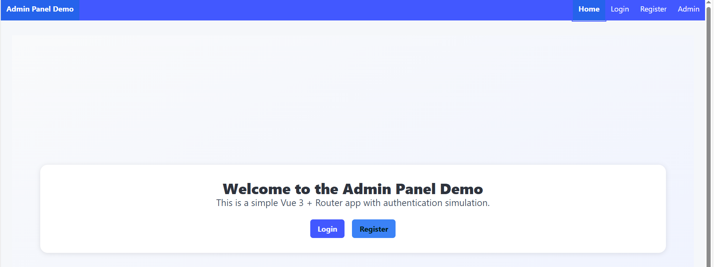
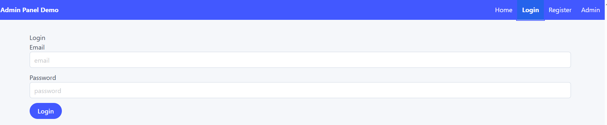
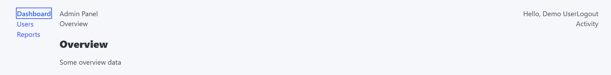
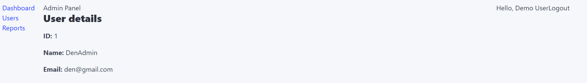
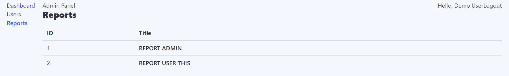

# Lab2

This template should help get you started developing with Vue 3 in Vite.

## Recommended IDE Setup

[VS Code](https://code.visualstudio.com/) + [Vue (Official)](https://marketplace.visualstudio.com/items?itemName=Vue.volar) (and disable Vetur).

## Recommended Browser Setup

- Chromium-based browsers (Chrome, Edge, Brave, etc.):
  - [Vue.js devtools](https://chromewebstore.google.com/detail/vuejs-devtools/nhdogjmejiglipccpnnnanhbledajbpd) 
  - [Turn on Custom Object Formatter in Chrome DevTools](http://bit.ly/object-formatters)
- Firefox:
  - [Vue.js devtools](https://addons.mozilla.org/en-US/firefox/addon/vue-js-devtools/)
  - [Turn on Custom Object Formatter in Firefox DevTools](https://fxdx.dev/firefox-devtools-custom-object-formatters/)

## Customize configuration

See [Vite Configuration Reference](https://vite.dev/config/).

## Project Setup

```sh
npm install
```

### Compile and Hot-Reload for Development

```sh
npm run dev
```

### Compile and Minify for Production

```sh
npm run build
```
### Lint with [ESLint](https://eslint.org/)

```sh
npm run lint
```
### Some ScreenShots 





### Functionl

## Authication users (this page control users)
```
const KEY = 'demo_auth_user'

export function login(email, password, name = 'Demo User') {
  if (!email || !password) return false
  const user = { id: 1, name, email }
  localStorage.setItem(KEY, JSON.stringify(user))
  return true
}

export function logout() {
  localStorage.removeItem(KEY)
}

export function getUser() {
  const raw = localStorage.getItem(KEY)
  return raw ? JSON.parse(raw) : null
}

export function isAuthenticated() {
  return !!getUser()
}

```

## Router pages (this contol navigation our project)
```
import { createRouter, createWebHistory } from 'vue-router'
import Home from '@/views/Home.vue'
import Login from '@/views/Login.vue'
import Register from '@/views/Register.vue'
import NotFound from '@/components/NotFound.vue'
import { isAuthenticated } from '@/store/auth'

// lazy-loaded admin children
const AdminLayout = () => import('@/views/admin/AdminLayout.vue')
const Dashboard = () => import('@/views/admin/Dashboard.vue')
const Users = () => import('@/views/admin/Users.vue')
const UserDetails = () => import('@/views/admin/UserDetails.vue')
const Reports = () => import('@/views/admin/Reports.vue')

const routes = [
  { path: '/', name: 'home', component: Home, meta: { public: true } },
  { path: '/login', name: 'login', component: Login, meta: { public: true } },
  { path: '/register', name: 'register', component: Register, meta: { public: true } },
  {
    path: '/admin',
    name: 'admin',
    component: AdminLayout,
    meta: { requiresAuth: true },
    children: [
      { path: 'dashboard', name: 'admin-dashboard', component: Dashboard },
      { path: 'users', name: 'admin-users', component: Users },
      { path: 'user/:id', name: 'admin-user', component: UserDetails, props: true },
      { path: 'reports', name: 'admin-reports', component: Reports }
    ]
  },
  { path: '/:pathMatch(.*)*', name: 'not-found', component: NotFound }
]

const router = createRouter({
  history: createWebHistory(),
  routes,
  scrollBehavior() {
    return { top: 0 }
  },
  linkActiveClass: 'is-active'
})

router.beforeEach((to, from, next) => {
  const auth = isAuthenticated()
  if (to.meta.requiresAuth && !auth) {
    next('/login')
  } else if (to.meta.public && auth && (to.path === '/login' || to.path === '/register')) {
    next('/admin/dashboard')
  } else {
    next()
  }
})

export default router
```

## Activity (you can check users activities)
```
<template>

<div class="content">
  <h3>Activity</h3>
  <p>Recent activity</p>
  </div>

</template>

<script>
export default { name: 'Activity' }
</script>

```