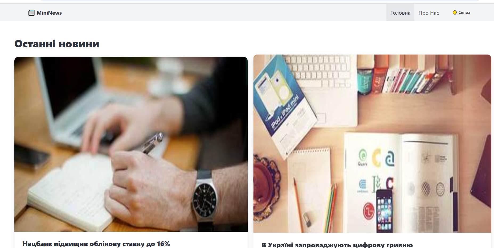
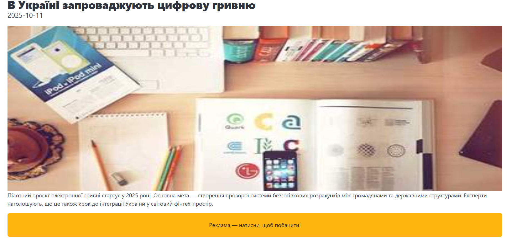
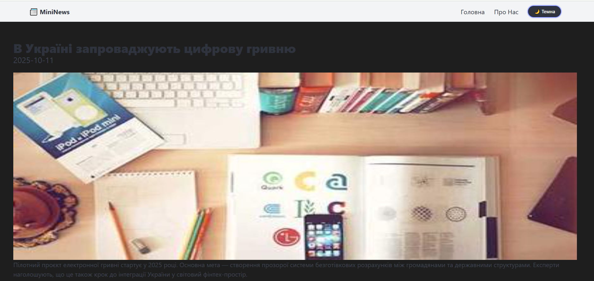
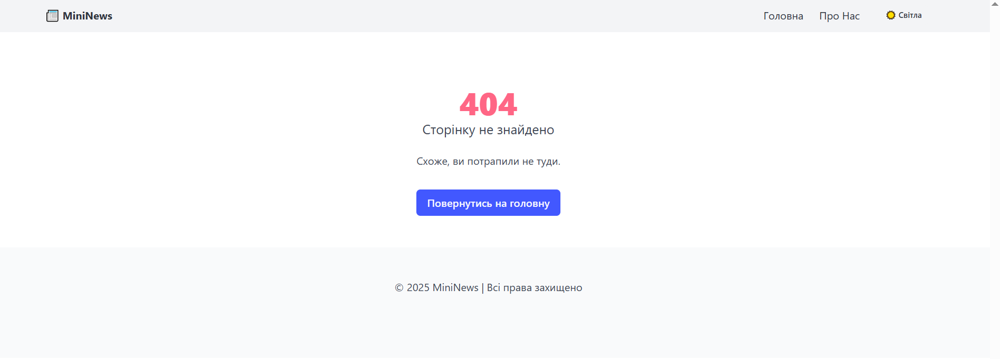
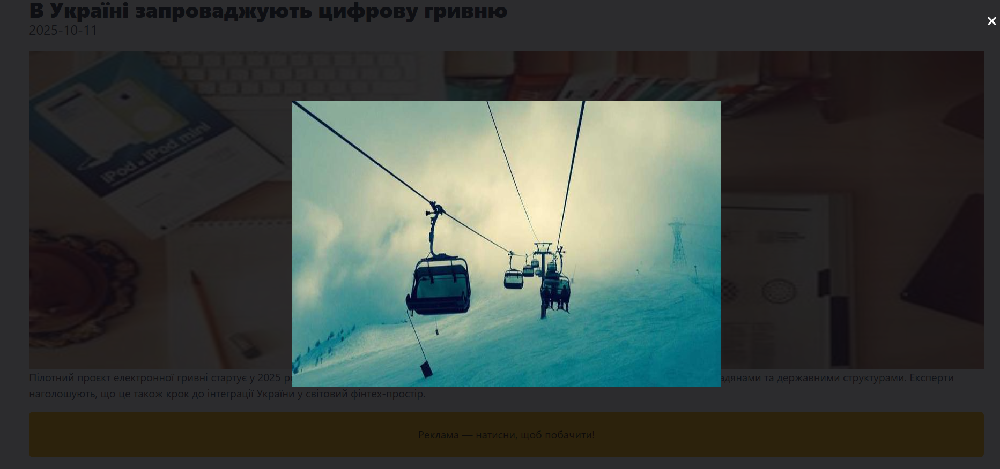

# Vue 3 + Vite

This template should help get you started developing with Vue 3 in Vite. The template uses Vue 3 `<script setup>` SFCs, check out the [script setup docs](https://v3.vuejs.org/api/sfc-script-setup.html#sfc-script-setup) to learn more.

Learn more about IDE Support for Vue in the [Vue Docs Scaling up Guide](https://vuejs.org/guide/scaling-up/tooling.html#ide-support).

# Lab3

This template should help get you started developing with Vue 3 in Vite.

## Customize configuration

See [Vite Configuration Reference](https://vite.dev/config/).

## Project Setup

```sh
npm install
```

### Compile and Hot-Reload for Development

```sh
npm run dev
```

### Some ScreenShots 






### Functionl

## Router Site
```
import { createRouter, createWebHistory } from 'vue-router'
import Home from './views/Home.vue'
import About from './views/About.vue'
import Article from './views/Article.vue'
import NotFound from './views/NotFound.vue'

const router = createRouter({
  history: createWebHistory(),
  routes: [
    { path: '/', component: Home },
    { path: '/about', component: About },
    { path: '/article/:id', component: Article },
    { path: '/:pathMatch(.*)*', name: 'NotFound', component: NotFound }
  ],
  scrollBehavior() {
    return { top: 0 }
  },
  linkActiveClass: 'is-active'
})

export default router
```

## Components ThemeToggle
```
<template>
  <button
    class="button is-small is-rounded"
    :class="isDark ? 'is-dark' : 'is-light'"
    @click="toggleTheme"
  >
    <span v-if="isDark">🌙 Темна</span>
    <span v-else>☀️ Світла</span>
  </button>
</template>

<script setup>
import { ref, watch, onMounted } from 'vue';

const isDark = ref(false);

onMounted(() => {
  const savedTheme = localStorage.getItem('theme');
  if (savedTheme === 'dark') {
    isDark.value = true;
    document.documentElement.classList.add('dark-theme');
  }
});

watch(isDark, (newVal) => {
  if (newVal) {
    document.documentElement.classList.add('dark-theme');
    localStorage.setItem('theme', 'dark');
  } else {
    document.documentElement.classList.remove('dark-theme');
    localStorage.setItem('theme', 'light');
  }
});

function toggleTheme() {
  isDark.value = !isDark.value;
}
</script>

<style scoped>
.button {
  font-weight: 600;
}
</style>
```

## Main file

```
<template>
  <div id="app">
    <header class="navbar is-light">
      <div class="container">
        <div class="navbar-brand">
          <router-link to="/" class="navbar-item has-text-weight-bold">
            📰 MiniNews
          </router-link>
        </div>

        <div class="navbar-menu">
          <div class="navbar-end">
            <router-link to="/" class="navbar-item" active-class="is-active">
              Головна
            </router-link>
            <router-link to="/about" class="navbar-item" active-class="is-active">
              Про Нас
            </router-link>
            <div class="navbar-item">
              <ThemeToggle />
            </div>
          </div>
        </div>
      </div>
    </header>

    <main>
      <Transition name="fade" mode="out-in">
        <RouterView />
      </Transition>
    </main>

    <footer class="footer has-text-centered">
      <p>© 2025 MiniNews | Всі права захищено</p>
    </footer>
  </div>
</template>

<script setup>
import ThemeToggle from './components/ThemeToggle.vue';
</script>

<style>
:root {
  --bg-color: #fff;
  --text-color: #222;
}

.dark-theme {
  --bg-color: #1e1e1e;
  --text-color: #f2f2f2;
}

body,
html {
  background-color: var(--bg-color);
  color: var(--text-color);
  transition: background-color 0.3s ease, color 0.3s ease;
}

.navbar,
.footer {
  background-color: var(--bg-color);
  transition: background-color 0.3s ease;
}

.fade-enter-from,
.fade-leave-to {
  opacity: 0;
  transform: translateY(10px);
}

.fade-enter-active,
.fade-leave-active {
  transition: all 0.3s ease;
}
</style>
```