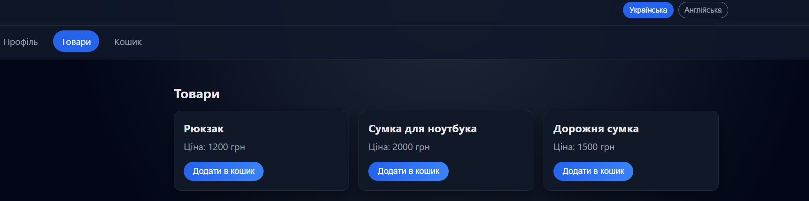
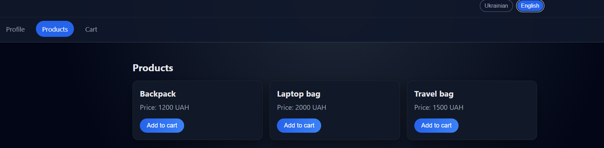
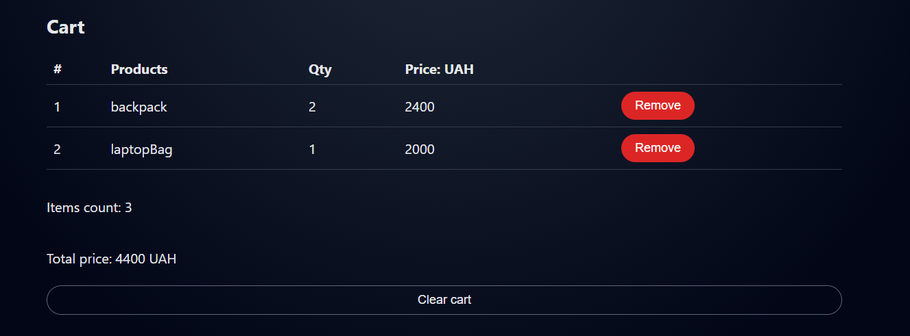
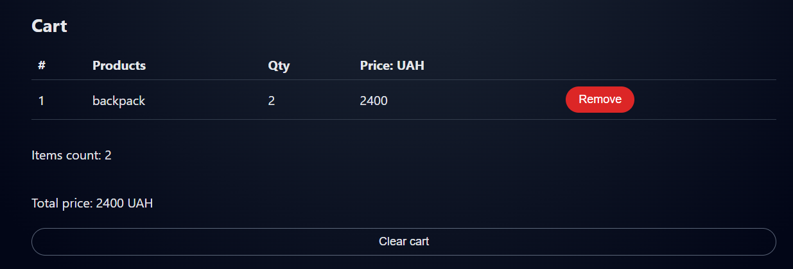

# Vue 3 + Vite

This template should help get you started developing with Vue 3 in Vite. The template uses Vue 3 `<script setup>` SFCs, check out the [script setup docs](https://v3.vuejs.org/api/sfc-script-setup.html#sfc-script-setup) to learn more.

Learn more about IDE Support for Vue in the [Vue Docs Scaling up Guide](https://vuejs.org/guide/scaling-up/tooling.html#ide-support).

# Lab4

This template should help get you started developing with Vue 3 in Vite.

## Customize configuration

See [Vite Configuration Reference](https://vite.dev/config/).

## Project Setup

```sh
npm install
```

### Compile and Hot-Reload for Development

```sh
npm run dev
```


### Some ScreenShots






### Functionl

## Pinia
<p> інцилізація в файлі src/main.js <p>
```
const pinia = createPinia()
pinia.use(piniaPluginPersistedstate)

app.use(pinia)
```

## i18n

```
import { createI18n } from 'vue-i18n'
import ua from './locales/ua.json'
import en from './locales/en.json'

export const i18n = createI18n({
  legacy: false,
  locale: 'ua',
  fallbackLocale: 'en',
  messages: {
    ua,
    en
  },
  modifiers: {
    upper: (str) => str.toUpperCase(),
    lower: (str) => str.toLowerCase(),
    capitalize: (str) => str.charAt(0).toUpperCase() + str.slice(1),
    
    exclaim: (str) => `${str}!`
  }
})
```

### Сторінки
##ProfilePage.vue

- Форма з полями: name, email, address, phones[]

- Валідація працює в реальному часі

- Телефони можуть додаватися/видалятися

## CartPage.vue

- Виведення товарів

- Додавання/видалення

- Переклади кнопок та заголовків

## ProductsPage.vue

- Вивід продуктів

- Переклад назв з productNames.xxx

- Додавання в кошик через Pinia
