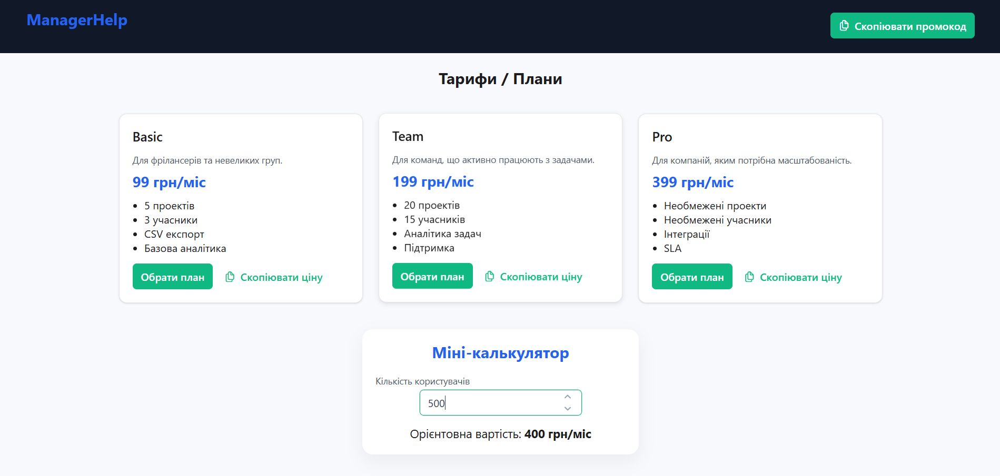
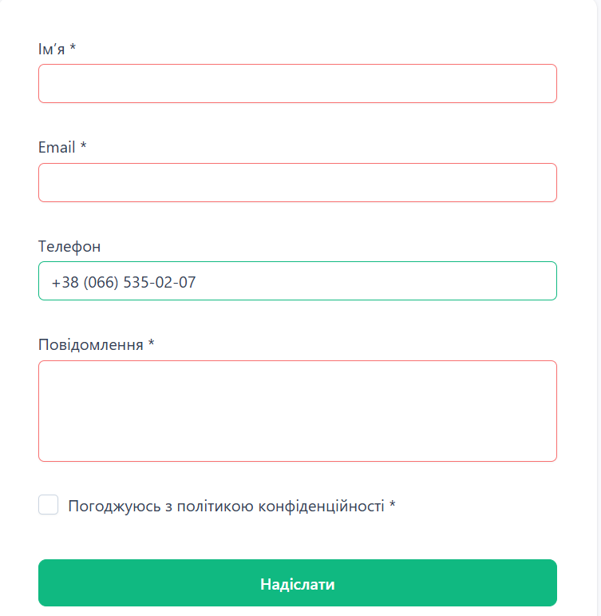

# Vue 3 + Vite

This template should help get you started developing with Vue 3 in Vite. The template uses Vue 3 `<script setup>` SFCs, check out the [script setup docs](https://v3.vuejs.org/api/sfc-script-setup.html#sfc-script-setup) to learn more.

Learn more about IDE Support for Vue in the [Vue Docs Scaling up Guide](https://vuejs.org/guide/scaling-up/tooling.html#ide-support).

# Lab5

This template should help get you started developing with Vue 3 in Vite.

## Customize configuration

See [Vite Configuration Reference](https://vite.dev/config/).

## Project Setup

```sh
npm install
```

### Compile and Hot-Reload for Development

```sh
npm run dev
```


## Some ScreenShots

Working Calculator

Form registration

Message for cope promocode

Result


## Functionl

### Plugin: CopyToClipboardPlugin
File: src/plugins/copyToClipboard.js
```
export default {
  install(app) {
    const copy = async (text) => {
      try {
        await navigator.clipboard.writeText(text);
        return true;
      } catch (err) {
        return false;
      }
    };

    app.config.globalProperties.$copy = copy;
    app.provide("copy", copy);
  }
};
```
### Install in file main.js 
```
import CopyToClipboardPlugin from './plugins/copyToClipboard';
app.use(CopyToClipboardPlugin);
```

### Using
```
const ok = await $copy("текст");
if (ok) toast.add({ severity: "success", summary: "Скопійовано!" });
```
## Header

- Logo

- Quick copy button of promo code through the plugin

## Hero

- Title

- Subheading

- CTA button

## Section «Problem → Solutions»

- Two white cards

- A clear contrasting description of the problem and the proposed solution

## Advantages

- 3 cards: Automation, Analytics, Teamwork

- Neat white blocks with shadows